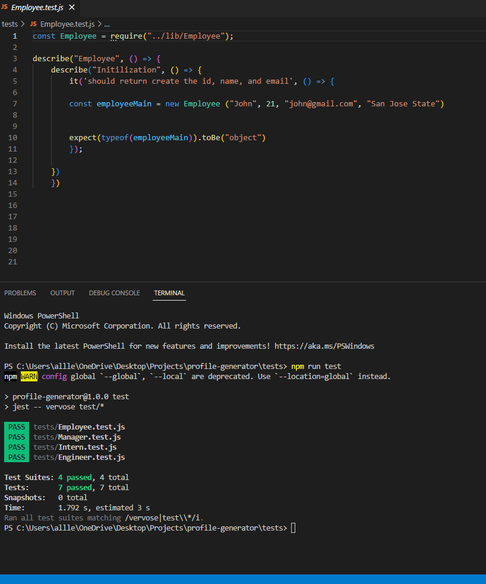

# Profile Generator 
  
  [](https://opensource.org/licenses/MIT)

  #Table of Content
  -[description](#Description)
  -[installation](#Installation)
  -[usage](#Usage)
  -[credits](#Credits)
  -[license](#License)
  -[contact](#Contact)

  ## Description:
  The purpose behind this project was to create a profile generator that will allow you to add as many team members as you wish. This generator allows you to choose from a manager, engineer, and intern. Each profile includes the team members name, id, email, and role. Now developing a team page can be done with ease. 

  You can see the profile generator layout below:

   

  ## Installation:
  In order to be able to utilize this generator within your command line, you would have to install node.js, npm inquirer package, and jest. Npm inquirer package allows for prompts to be displayed to you within the command line. For this project, I utilized jest to test my code, therefore if I later make changes to my code I can do it with ease. I will be able to see were my code is breaking and have a better understanding of what to fix. 

  Below, I have displayed how I utilized inquirer to prompt questions within the command line:

   

  Below, I have displayed how I utilized jest to test my code within the command line:

  


  ## Usage:
  You will be prompted with questions inside the command line to help you generate your team. You can either answer the question or leave it blank to move on to the next question. Your answers to the questions will then be generated below the correct section of employee type you choose to create. Once you are done adding team members to your template a html file will be generated for you. Once this is opened on the browser you will be displayed with cards of each team member you added. This design was done utilizing bootstrap. 
  
  Here you can see how I have used 
  ```
  fs.writeFile
  ```
  
  


  ## Credits:
  Helpful video: https://www.youtube.com/watch?v=Jv2uxzhPFl4&t=565s
  Documentation needed for jest: https://jestjs.io/docs/getting-started
  I utilized https://gist.github.com/lukas-h/2a5d00690736b4c3a7ba to generate markdown license badges.
  Contribution: Priya Rizal

 
  ## License:
  MIT 

  ## Contact:
  allleizq@gmail.com